# Project-1
for project 1
INSTALLING APACHE AND UPDATING THE FIREWALL
To install apache server, I run command `sudo apt update` to update my server. The image below is the output generated

After updating the package, I run command `sudo apt instal apache2` and the output in the image below was obtained

I ran command `sudo systemctl apache2` to check if apache2 is running as a service in ubuntu. The output displayed in the image below was obtained

I tested Apache2 response to requests from internet by testing the [Apache2](https://34.237.243.178:80

I used `sudo apt install mysql-server` to install MySQL DBMS

I logged on to the MYSQL console by tying `sudo mysql` got the output in the image below

I set up a password for the root user by using `mysql_native_password`

I exited mysql and started running the interactive script using the command language `sudo mysql_secure_installation` 

I tested to know if I can log into mysql console by using `sdo mysql -p` command

I installed 3 packages php, libapache2-mod-php and php-mysql using `sudo apt install php libapache2-mod-php php-mysql`

I run the command `php -v` to confirm the php version. 

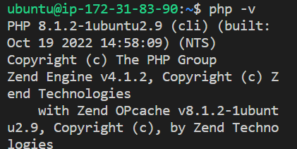

Created directory for 'ayodotun' using 'mkdir' command `sudo mkdir /var/www/ayodotun`

Also assigned ownership of the directory using `sudo chown -R $USER:$USER /var/www/ayodotun`

Created and opened a new configuration in the directory using the vi command `sudo vi /etc/apache2/sites-available/ayodotun.conf`

Pasted the bare-bones configuration in the blank file after hitting on i.

Saved and closed file. Used the ls command to show new file in the sites-available directory `sudo ls /etc/apache2/sites-available`

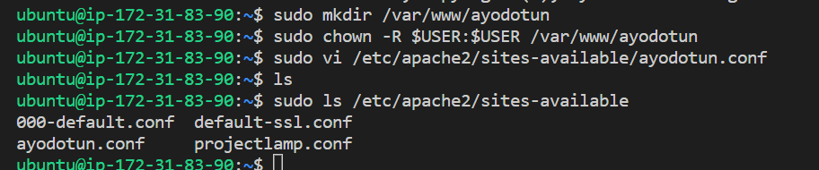

I enabled the new virtual host using `sudo a2ensite ayodotun`

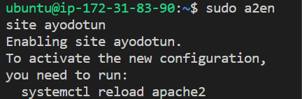

Used command `sudo a2dissite 000-default` to disable default website that comes with apache

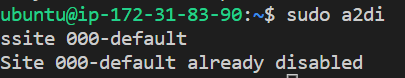

Checked to know that configuration file does not contain any syntax errors using `sudo apache2ctl configtest`

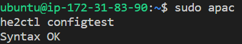

Reloaded apache so that changes can take effect using command `sudo systemctl reload apache2`

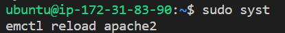

index.html file was created in the location to facilitate test using `sudo echo 'Hello LAMP from hostname' $(curl -s http://169.254.169.254/latest/meta-data/public-hostname) 'with public IP' $(curl -s http://169.254.169.254/latest/meta-data/public-ipv4) > /var/www/ayodotun/index.html`

I logged on to the http://44.211.38.254:80 to know if the the apache virtual host is work.

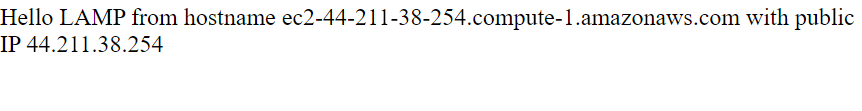

Accessed website using DNS name. 

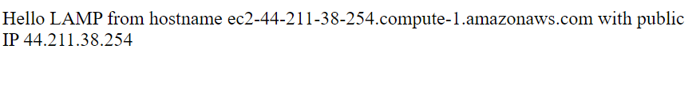

I changed the directory mode using `sudo vim /etc/apache2/mods-enabled/dir.conf`

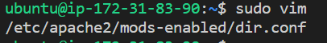

To change the directory file to index.php I used command `sudo vim /etc/apache2/mods-enabled/dir.conf`
I inserted and saved the file. Also reloaded Apache2 using command `sudo systemctl reload apache2`

The PHP test script was also created to know if PHP is installed and configured correctly on the server. I used `vim /var/www/ayodotun/index.php`

This opened a blank file where `<?php
phpinfo();` was pasted. The file was saved.

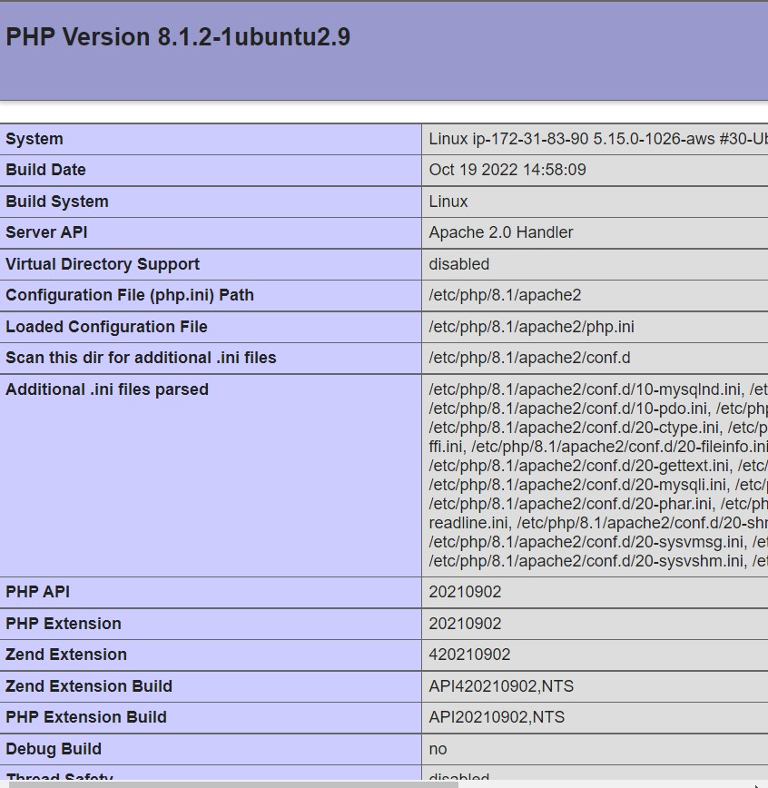

File was removed using the command `sudo rm /var/www/ayodotun/index.php`
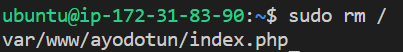